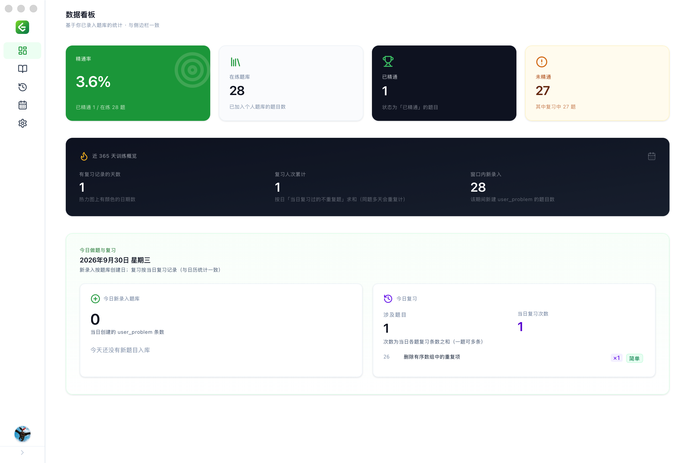
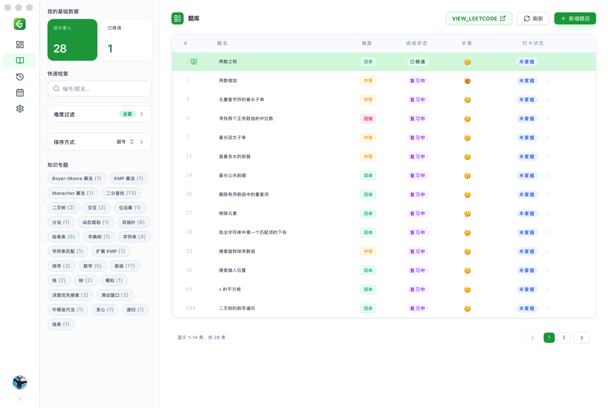
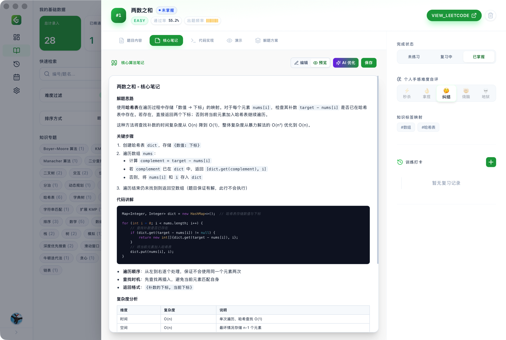
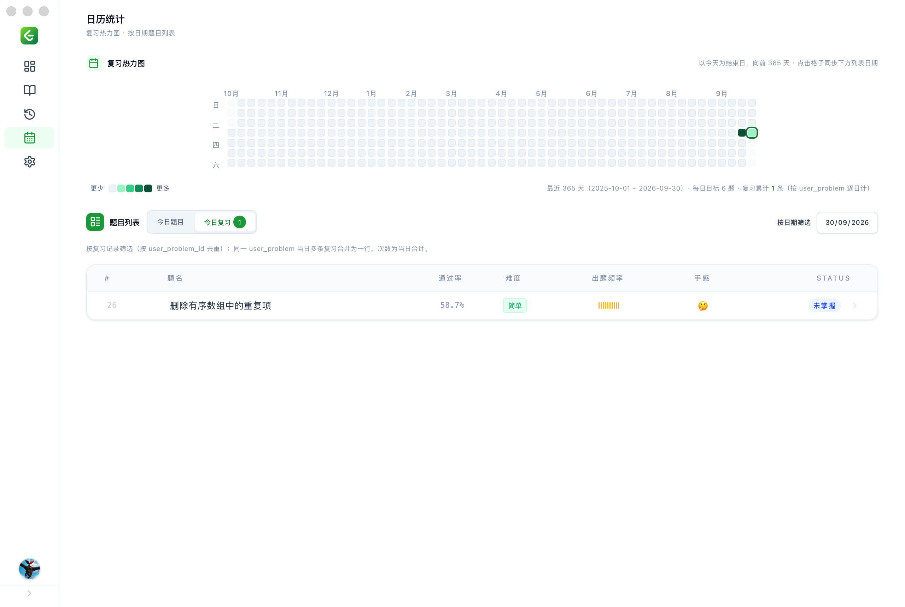
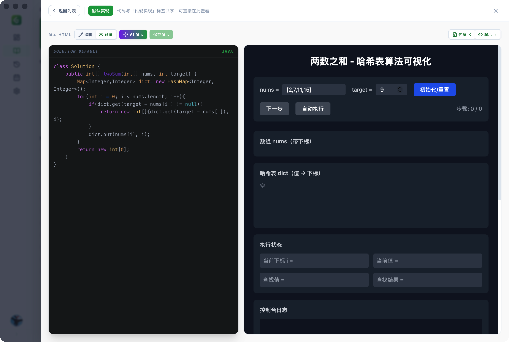
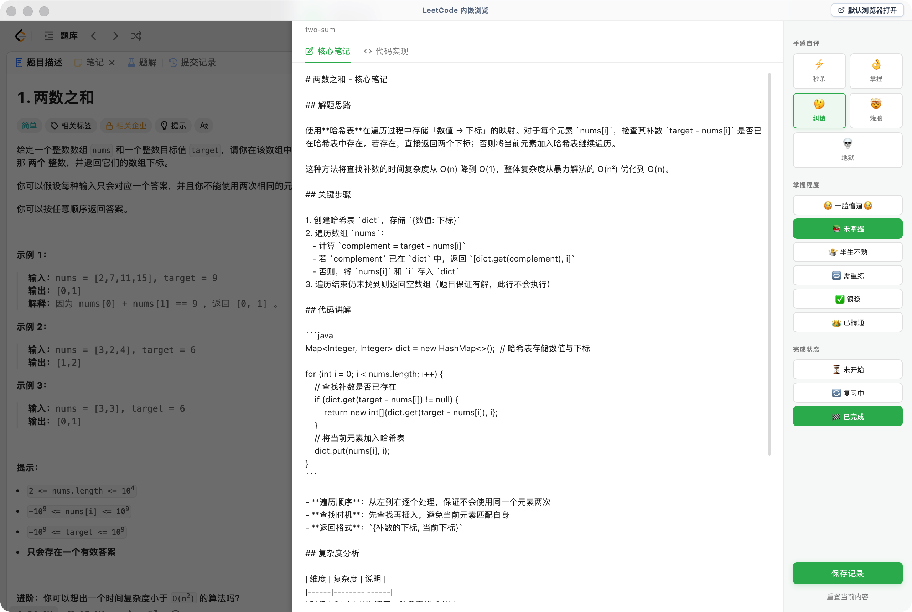
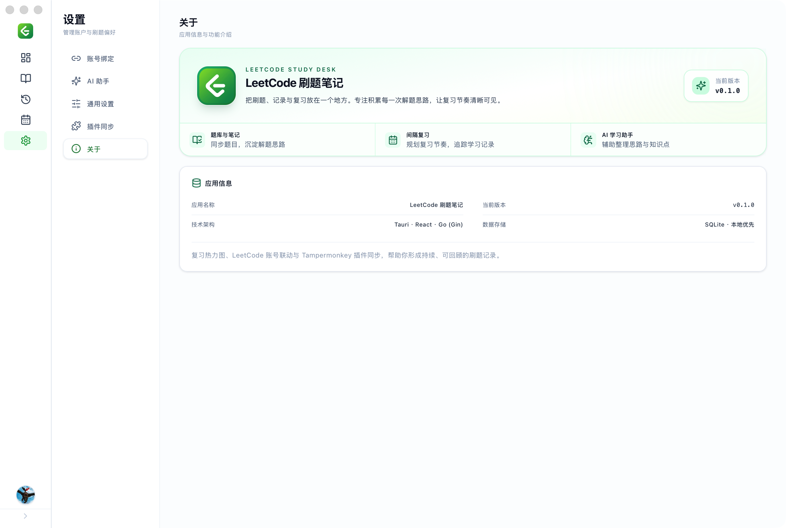
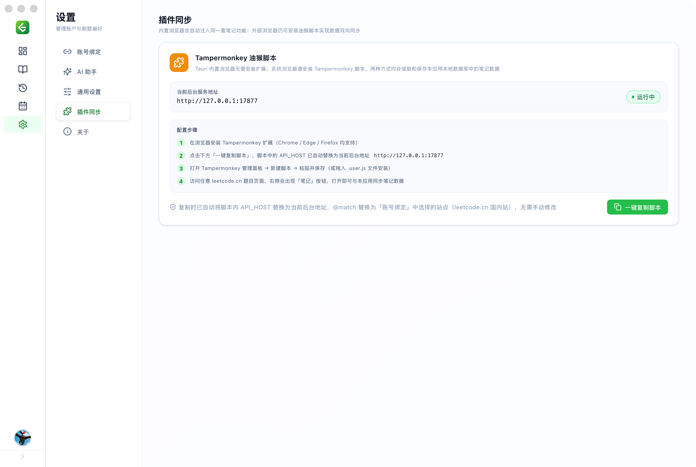
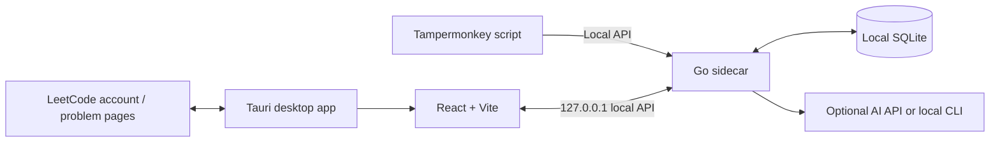

<div align="center">
  <p><a href="README.md">简体中文</a> | <a href="README.en.md">English</a></p>
  
  <h1>LeetCode Notes</h1>
  <p><strong>Bring coding practice, note-taking, and review together in one continuous learning path.</strong></p>
  <p>A local-first desktop learning companion for long-term practice. Sync LeetCode problems, organize your solutions, use AI to understand code, and track your progress through review sessions.</p>
  <p>
    
    
    
    
    
    
  </p>
</div>

<p align="center">
  
</p>

## Why LeetCode Notes

The value of coding practice goes beyond getting an accepted submission. What matters is remembering why you chose an approach, recalling it when a similar problem comes up, and seeing how far you have come through consistent practice.

LeetCode Notes brings problems, personal notes, practice history, and review plans together. It uses a local-first desktop architecture: your problem library and learning records are stored in a local SQLite database, and you do not need an account for this project.

## Features

| Feature | What you can do |
| --- | --- |
| **LeetCode account and problem import** | Link an account from LeetCode China or the international LeetCode site, view profile and practice statistics, and import solved problems into your local library. |
| **Personal problem library and notes** | Organize practice by problem, difficulty, and tags. Add a personal difficulty rating, mastery and progress status, code, and Markdown notes to each problem. |
| **Random review** | Draw problems from your library to revisit and rewrite solutions. Record your mastery, code, and practice notes for each review. |
| **AI learning assistant** | Configure an OpenAI-compatible endpoint, the Anthropic API, or local CLI tools such as Codex and Claude. Ask questions with streaming responses, keep conversation history, and get help understanding code and organizing notes. |
| **AI code walkthroughs** | Give the AI the current problem and a selected solution, and have it generate an interactive HTML walkthrough that shows execution step by step. Edit, preview, and save walkthroughs to better understand data structures and code execution. |
| **Safe walkthrough preview** | View saved HTML solution walkthroughs in problem details. Walkthroughs are displayed in an isolated iframe. |
| **Built-in LeetCode browser** | Open LeetCode problem pages in the app and record your learning with built-in notes and practice check-ins. |
| **Tampermonkey script** | Copy the site-specific script generated in app settings. Use it in an external browser to record problem notes, code, mastery, and practice check-ins, then sync them to the local app. |
| **Learning calendar and heatmap** | Review recent learning and review activity, revisit problems added and reviews completed on a selected day, and set a daily learning goal. |

## Screenshots

### From overall progress to daily activity

<table>
  <tr>
    <td align="center" width="50%"><strong>Learning dashboard</strong><br /></td>
    <td align="center" width="50%"><strong>Personal problem library</strong><br /></td>
  </tr>
  <tr>
    <td align="center"><strong>Problem details and solution notes</strong><br /></td>
    <td align="center"><strong>Learning and review heatmap</strong><br /></td>
  </tr>
</table>

### AI, review, and browser-based practice

<table>
  <tr>
    <td align="center" width="50%"><strong>AI-assisted learning and walkthroughs</strong><br /></td>
    <td align="center" width="50%"><strong>Random review</strong><br /></td>
  </tr>
  <tr>
    <td align="center"><strong>Account linking and practice statistics</strong><br /></td>
    <td align="center"><strong>Tampermonkey sync</strong><br /></td>
  </tr>
</table>

## How it works

The desktop app consists of a Tauri window, a React frontend, and a local Go service. The Go service runs as a sidecar when the app starts and provides the local API, data access, and AI provider integrations. During browser-based development, Vite proxies `/api` requests to the local service.



### Tech stack

| Part | Technology | Purpose |
| --- | --- | --- |
| Desktop app | Tauri 2, Rust | Desktop window, system integration, and Go sidecar lifecycle management |
| Frontend | React 18, Vite, Tailwind CSS | Problem library, dashboard, problem details, review, calendar, AI, and settings pages |
| Local service | Go, Gin | Local HTTP API, LeetCode data retrieval, review, and AI service routing |
| Database | SQLite, `modernc.org/sqlite` | Stores problems, personal learning status, review history, settings, and AI conversations |
| AI | OpenAI-compatible API, Anthropic API, CLI | A unified provider configuration for different models and local AI tools |

## Getting started

This repository currently provides the source code and a development preview. The version number, download area, and release notes on the website are static preview content; download links for official installers are not configured yet.

### Develop the desktop app

Install Node.js/npm, Go, and the Rust toolchain, along with the Tauri build dependencies for your operating system. Then run this from the project root:

```bash
npm install
npm run tauri dev
```

`tauri dev` first builds the Go sidecar for the current platform, then starts Vite and the desktop app.

### Debug the frontend in a browser

Start the local Go service in one terminal:

```bash
cd server
go run . --port 17877 --dev
```

Then start Vite from the project root in another terminal:

```bash
npm run dev
```

The Vite development server runs at `http://localhost:1420` by default and proxies `/api` requests to `http://127.0.0.1:17877`. Browser mode is suitable for developing regular pages. Use the desktop development command to try Tauri-specific windows and system features.

### Configure LeetCode and AI

1. In app settings, open **Account Linking**, choose LeetCode China or the international LeetCode site, and link your account.
2. After viewing your profile and practice statistics, use **Import Solved Problems** if you want to add those problems to your local library.
3. Add an API provider in **AI Assistant** settings, or configure a supported local AI CLI tool. AI features require a service configuration that you provide.
4. In **Plugin Sync** settings, copy the Tampermonkey script and install it in your browser extension. In the built-in browser, you can use the built-in notes and practice check-in features directly.

## Build

Build the desktop app for the current platform:

```bash
npm run tauri build
```

Build the Go sidecar separately:

```bash
bash scripts/build-sidecar.sh
```

The script selects a sidecar target based on the Rust host target and writes the output to `src-tauri/binaries/`. You can also pass a supported target triple explicitly, for example:

```bash
bash scripts/build-sidecar.sh aarch64-apple-darwin
```

## Standalone website preview

The website source is in `website/` and is built separately from the desktop app. It uses screenshots directly from `docs/image/`.

```bash
npm run dev --prefix website
npm run build --prefix website
npm run preview --prefix website
```

The app version, download button, and release notes on the website are currently static preview content. They can be connected to real release information once official builds and download URLs are available.

## Project structure

```text
.
├── src/                         # React desktop app frontend
│   ├── api/                     # Local API client
│   ├── components/              # Problem, calendar heatmap, built-in browser, and other components
│   └── pages/                   # Dashboard, library, problem, calendar, AI, and settings pages
├── server/                      # Go sidecar, local API, and SQLite data layer
├── src-tauri/                   # Tauri 2 desktop shell and platform configuration
├── tamper-monkey/               # LeetCode page notes and practice check-in script
├── website/                     # Standalone Vite + React website preview
├── docs/image/                  # Screenshots used by the website and README
└── scripts/build-sidecar.sh     # Go sidecar build script
```

## Local data and external services

- The problem library, learning status, review history, app settings, and AI conversations are stored in a local SQLite database.
- When you link a LeetCode account, sync problems, or use the browser plugin, the app accesses LeetCode services as required by those features.
- When using an API-based AI provider, the configured third-party service processes the content sent to the model. A CLI provider runs a tool installed on your machine. Configure AI features according to your privacy and service requirements.
- In production, the sidecar listens on `127.0.0.1` by default. Development mode uses `--dev` to allow the local frontend to connect.

## Version

The current project version is **0.1.0 (preview)**. Features and the interface are still evolving. Platform download instructions and release notes will be added here when official installers are available.

