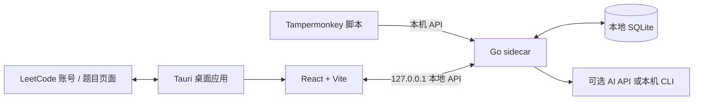

<div align="center">
  <p><a href="README.md">简体中文</a> | <a href="README.en.md">English</a></p>
  
  <h1>LeetCode 笔记</h1>
  <p><strong>把刷题、记录和复习，放进一条连贯的学习路径。</strong></p>
  <p>面向长期练习的本地优先桌面学习助手。同步 LeetCode 题目，整理解题思路，借助 AI 理解代码，再用复习记录看见自己的进步。</p>
  <p>
    
    
    
    
    
    
  </p>
</div>

<p align="center">
  
</p>

## 为什么做 LeetCode 笔记

刷题的价值不只在于提交通过。真正有用的，是记住当时为什么这样想、下次遇到相似问题时能不能想起来，以及持续练习后自己走了多远。

LeetCode 笔记把题目、个人笔记、训练记录和复习安排放在一起。应用采用本地优先的桌面架构，核心题库和学习记录存放在本机 SQLite 数据库中，不需要注册本项目账号。

## 功能一览

| 功能 | 可以做什么 |
| --- | --- |
| **LeetCode 账号与题目导入** | 绑定力扣中国站或 LeetCode 国际站账号，查看账号资料和刷题统计；一键导入已解决题目到本地题库。 |
| **个人题库与题目笔记** | 按题目、难度和标签整理练习记录；为题目添加个人难度评分、掌握状态、进度状态、代码和 Markdown 笔记。 |
| **随机复习** | 从题库中抽取需要复习的题目，重新编写和回顾解法；记录每次复习的掌握程度、代码和训练笔记。 |
| **AI 学习助手** | 配置 OpenAI 兼容接口、Anthropic API，或本机 Codex、Claude 等命令行工具；进行流式问答并保留会话记录，辅助理解代码与梳理笔记。 |
| **AI 代码演示** | 根据当前题目内容和所选代码方案，让 AI 生成逐步执行的交互式 HTML 演示；可编辑、预览和保存演示，帮助理解数据结构与代码执行过程。 |
| **安全演示预览** | 在题目详情中查看已保存的 HTML 题解演示。演示内容在隔离 iframe 中展示。 |
| **内置 LeetCode 浏览器** | 在应用中打开 LeetCode 题目页面，配合内置笔记与训练打卡功能记录学习过程。 |
| **Tampermonkey 插件** | 从应用设置中复制为当前站点生成的脚本，在外部浏览器里记录题目笔记、代码、掌握程度和训练打卡，并同步到本地应用。 |
| **学习日历与热力图** | 查看近期学习与复习活动；选择某一天回顾当天新增的题目和复习记录，并设置每日学习目标。 |

## 应用截图

### 从全局进度到每日记录

<table>
  <tr>
    <td align="center" width="50%"><strong>学习数据看板</strong><br /></td>
    <td align="center" width="50%"><strong>个人题库</strong><br /></td>
  </tr>
  <tr>
    <td align="center"><strong>题目详情与解题笔记</strong><br /></td>
    <td align="center"><strong>学习与复习热力图</strong><br /></td>
  </tr>
</table>

### AI、复习与浏览器记录

<table>
  <tr>
    <td align="center" width="50%"><strong>AI 辅助理解与演示</strong><br /></td>
    <td align="center" width="50%"><strong>随机复习</strong><br /></td>
  </tr>
  <tr>
    <td align="center"><strong>账号绑定与刷题统计</strong><br /></td>
    <td align="center"><strong>Tampermonkey 数据同步</strong><br /></td>
  </tr>
</table>

## 工作方式

桌面应用由 Tauri 窗口、React 前端和本地 Go 服务组成。Go 服务以 sidecar 进程随应用启动，提供本地 API、数据读写和 AI Provider 接入；浏览器调试时，Vite 将 `/api` 请求代理到本地服务。



### 技术栈

| 部分 | 技术 | 用途 |
| --- | --- | --- |
| 桌面应用 | Tauri 2、Rust | 桌面窗口、系统集成和 Go sidecar 生命周期管理 |
| 前端 | React 18、Vite、Tailwind CSS | 题库、数据看板、题目详情、复习、日历、AI 与设置页面 |
| 本地服务 | Go、Gin | 本地 HTTP API、LeetCode 数据获取、复习和 AI 服务路由 |
| 数据库 | SQLite、`modernc.org/sqlite` | 保存题目、个人学习状态、复习历史、设置和 AI 会话 |
| AI | OpenAI 兼容 API、Anthropic API、CLI | 通过统一 Provider 配置调用不同模型或本机 AI 工具 |

## 开始使用

当前仓库提供源码和开发预览。官网中的版本号、下载区域和更新日志是静态演示信息，尚未配置正式安装包下载地址。

### 桌面应用开发

准备 Node.js/npm、Go 和 Rust 工具链，以及当前操作系统所需的 Tauri 桌面构建依赖。然后在项目根目录运行：

```bash
npm install
npm run tauri dev
```

`tauri dev` 会先编译当前平台的 Go sidecar，再启动 Vite 和桌面应用。

### 仅在浏览器中调试前端

先在一个终端启动 Go 本地服务：

```bash
cd server
go run . --port 17877 --dev
```

然后回到项目根目录，在另一个终端启动 Vite：

```bash
npm run dev
```

Vite 开发服务器默认运行在 `http://localhost:1420`，并将 `/api` 请求代理至 `http://127.0.0.1:17877`。浏览器调试模式适合开发常规页面；Tauri 专属窗口和系统功能请通过桌面开发命令体验。

### 配置 LeetCode 与 AI

1. 打开应用设置中的 **账号绑定**，选择力扣中国站或 LeetCode 国际站并完成绑定。
2. 查看账号资料和刷题统计后，可按需执行 **导入已解决题目**，将题目添加到本地题库。
3. 在 **AI 助手** 设置中添加 API Provider，或配置本机支持的 AI 命令行工具。AI 功能需要由你提供可用的服务配置。
4. 在 **插件同步** 设置中复制 Tampermonkey 脚本，并安装到浏览器扩展中；应用内置浏览器可以直接使用内置笔记与打卡入口。

## 构建

构建当前平台的桌面应用：

```bash
npm run tauri build
```

单独编译 Go sidecar：

```bash
bash scripts/build-sidecar.sh
```

脚本会根据 Rust host target 选择 sidecar 目标平台，并输出到 `src-tauri/binaries/`。也可以显式传入脚本支持的 target triple，例如：

```bash
bash scripts/build-sidecar.sh aarch64-apple-darwin
```

## 独立官网预览

官网源码位于 `website/`，与桌面应用入口分开构建；展示截图直接来自 `docs/image/`。

```bash
npm run dev --prefix website
npm run build --prefix website
npm run preview --prefix website
```

官网中的应用版本、下载按钮和更新日志目前为静态预览。获得正式发布包和下载地址后，可以再接入真实发布信息。

## 项目结构

```text
.
├── src/                         # React 桌面应用前端
│   ├── api/                     # 本地 API 客户端
│   ├── components/              # 题目、日历热力图、内置浏览器等组件
│   └── pages/                   # 看板、题库、题目、日历、AI 与设置
├── server/                      # Go sidecar、本地 API 与 SQLite 数据层
├── src-tauri/                   # Tauri 2 桌面壳与平台配置
├── tamper-monkey/               # LeetCode 页面笔记与打卡脚本
├── website/                     # 独立 Vite + React 官网预览
├── docs/image/                  # 官网和 README 使用的应用截图
└── scripts/build-sidecar.sh     # Go sidecar 编译脚本
```

## 本地数据与外部服务

- 题库、学习状态、复习记录、应用设置和 AI 会话保存在本地 SQLite 数据库中。
- 绑定 LeetCode 账号、同步题目或使用浏览器插件时，应用会按相应功能访问 LeetCode 服务。
- 使用 API 类 AI Provider 时，发送给模型的内容会由所配置的第三方服务处理；使用 CLI Provider 时则调用本机安装的工具。请根据自己的隐私和服务要求配置 AI 功能。
- 生产 sidecar 默认只监听本机 `127.0.0.1`。开发模式使用 `--dev`，供本地前端调试连接。

## 版本

当前项目版本：**0.1.0（预览）**。功能和界面仍在迭代中；正式安装包发布后，会在此补充各平台下载方式与版本变更记录。
